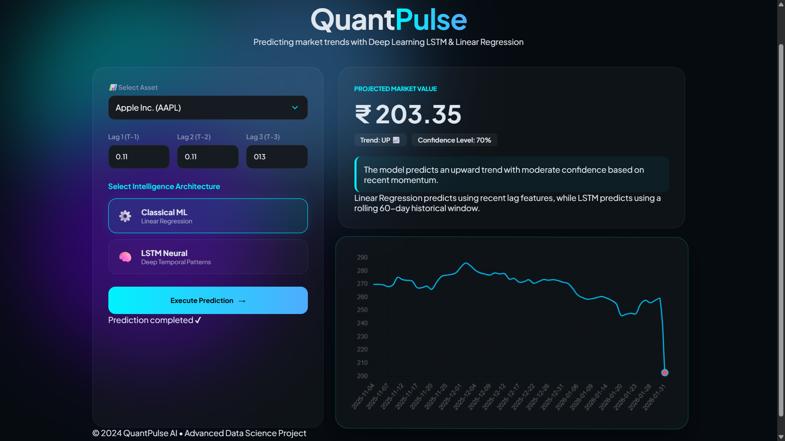

# 📈 QuantPulse AI - Stock Market Prediction System

An AI-powered Stock Market Prediction System that forecasts future stock prices using both Machine Learning and Deep Learning techniques.

## 📸 Dashboard Preview



---

This project compares the performance of:

- ⚙️ Linear Regression (Machine Learning)
- 🧠 LSTM (Long Short-Term Memory Neural Network)

The system fetches real-time historical stock data from Yahoo Finance, processes the data, trains predictive models, and provides stock price forecasts through an interactive Flask web application.

---

## 🚀 Features

- Predict future stock prices
- Compare Machine Learning vs Deep Learning models
- Real-time stock data collection using Yahoo Finance
- Interactive dashboard with modern UI
- Market trend prediction (UP 📈 / DOWN 📉)
- Confidence score generation
- 60-Day historical stock visualization
- Multi-stock support (AAPL, INFY, TCS)

---

## 🧠 Models Used

### 1. Linear Regression

A traditional Machine Learning algorithm that predicts stock prices using the previous three trading days.

**Features Used**
- Lag_1 (Previous Day)
- Lag_2 (Two Days Before)
- Lag_3 (Three Days Before)

**Advantages**
- Fast training
- Easy to interpret
- Lightweight

---

### 2. LSTM (Long Short-Term Memory)

A Deep Learning model designed for sequential and time-series data.

**Features**
- Uses a 60-day rolling historical window
- Learns long-term market patterns
- Captures temporal dependencies

**Advantages**
- Better at identifying trends
- Suitable for stock market forecasting
- Learns complex price movements

---

## 🏗️ Project Workflow

```text
Yahoo Finance
      ↓
Data Collection
      ↓
Data Preprocessing
      ↓
Feature Engineering
      ↓
 ┌──────────────┐
 │              │
 ↓              ↓
Linear      LSTM
Regression  Network
 ↓              ↓
Prediction Engine
      ↓
Flask Backend
      ↓
Web Dashboard
      ↓
Stock Forecast
```

---

## 📂 Project Structure

```text
QuantPulse-AI/
│
├── backend/
│   ├── app.py
│   ├── data_fetch.py
│   ├── data_preprocessing.py
│   ├── model_training.py
│   ├── lstm_training.py
│   └── prediction.py
│
├── frontend/
│   ├── templates/
│   │   └── index.html
│   │
│   └── static/
│       ├── css/
│       │   └── style.css
│       │
│       └── js/
│           └── script.js
│
├── data/
│   └── Stock Datasets
│
├── outputs/
│   └── Prediction Graphs
│
├── README.md
├── run_project.py
└── .gitignore
```

---

## 🛠️ Technologies Used

### Frontend
- HTML5
- CSS3
- JavaScript
- Chart.js

### Backend
- Python
- Flask

### Machine Learning
- Scikit-Learn
- Linear Regression

### Deep Learning
- TensorFlow
- Keras
- LSTM

### Data Processing
- Pandas
- NumPy
- MinMaxScaler

### Data Source
- Yahoo Finance API (yfinance)

---

## 📊 Dataset

Historical stock market data is collected directly from Yahoo Finance.

Supported Stocks:

- Apple (AAPL)
- Infosys (INFY)
- Tata Consultancy Services (TCS)

Data includes:

- Date
- Closing Price

Period:

- Last 5 Years Historical Data

---

## ⚙️ Installation

### Clone Repository

```bash
git clone https://github.com/yourusername/QuantPulse-AI.git
cd QuantPulse-AI
```

### Create Virtual Environment

```bash
python -m venv lstm_env
```

### Activate Environment

Windows

```bash
lstm_env\Scripts\activate
```

Linux / Mac

```bash
source lstm_env/bin/activate
```

### Install Dependencies

```bash
pip install -r requirements.txt
```

---

## ▶️ Run Application

```bash
python backend/app.py
```

Open Browser:

```text
http://127.0.0.1:5000
```

---

## 📈 Output

The system displays:

- Predicted Stock Price
- Trend Direction
- Confidence Score
- Market Summary
- Historical Price Chart
- Future Price Forecast

---

## 🎯 Key Learning Outcomes

This project helped in understanding:

- Time Series Forecasting
- Machine Learning Workflows
- Deep Learning with LSTM
- Data Preprocessing
- Feature Engineering
- Flask API Development
- Frontend Integration
- Financial Data Analysis

---

## 🔮 Future Improvements

- Transformer-based forecasting models
- GRU Neural Networks
- Real-time live stock updates
- Multiple stock comparison
- Technical Indicators (RSI, MACD, EMA)
- Portfolio recommendation system
- News sentiment analysis integration

---

## 👨‍💻 Author

**Devakumar A**

B.Tech Computer Science and Engineering

Rajiv Gandhi College of Engineering and Technology

Scopus Published Researcher

President - Mathoria Maths Club

GitHub: https://github.com/Devakumar-A

LinkedIn: https://www.linkedin.com/in/devakumar-a-129561305

ORCiD :  https://orcid.org/0009-0003-8934-6744

---

## 📜 License

This project is developed for educational and research purposes.
